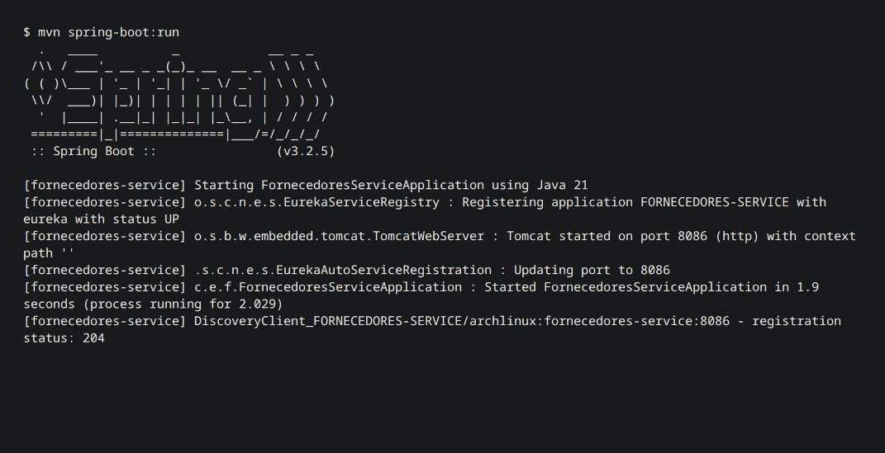
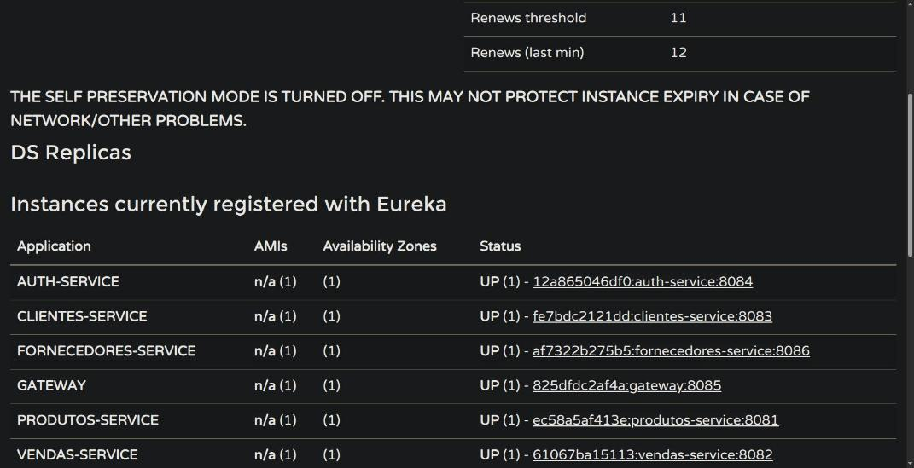
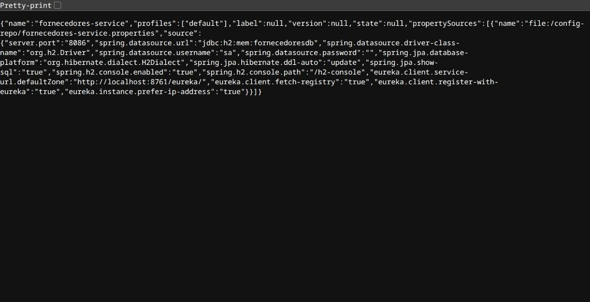
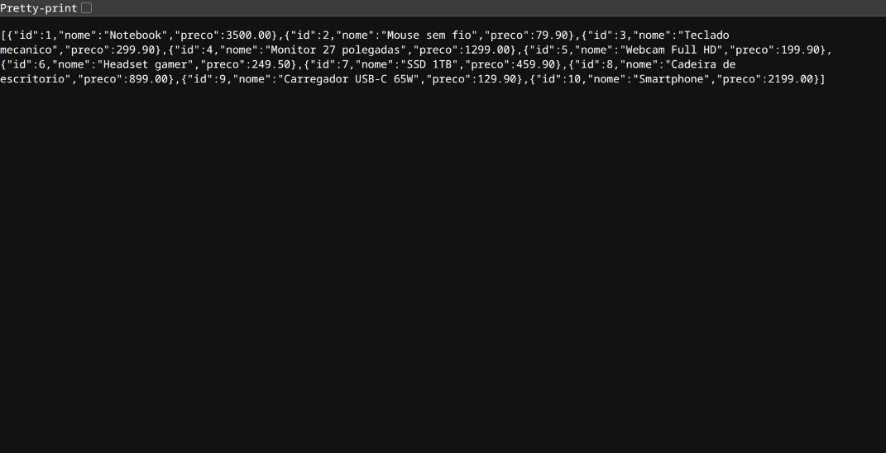
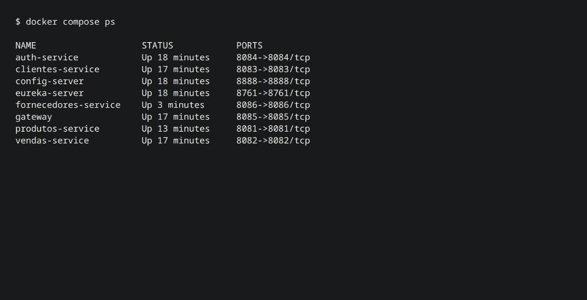
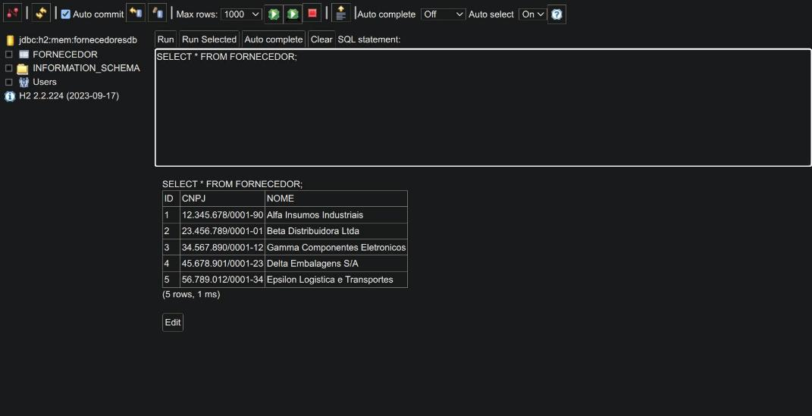
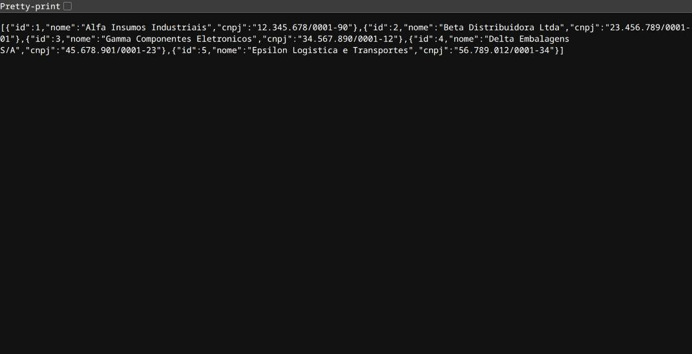
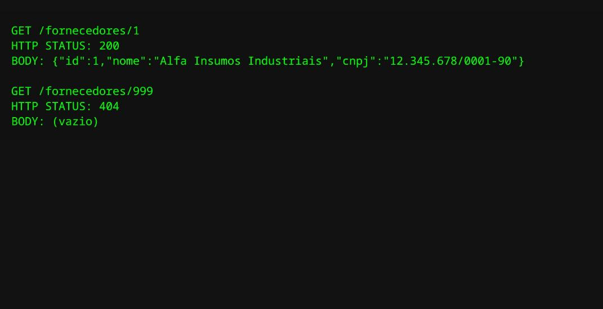
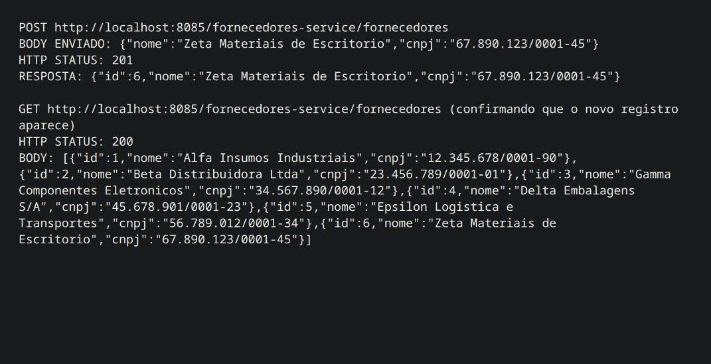
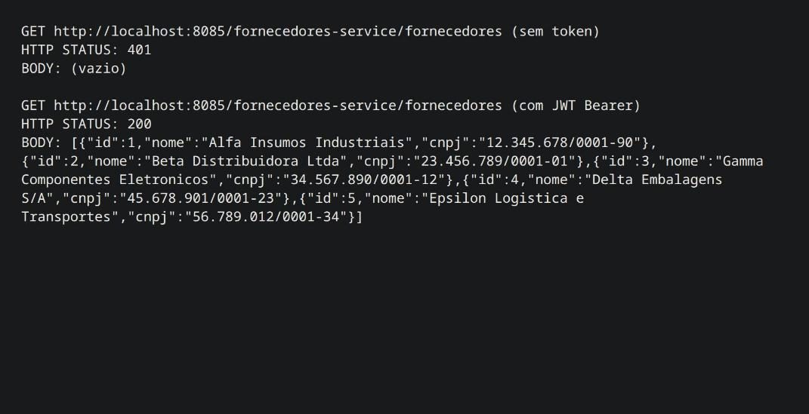

# AT — Microsserviços com Spring Cloud

**Aluno:** Fernando Araújo Maia Machado

Este é o projeto final. O código está em [api-vendas](api-vendas/) (serviço criado:
[fornecedores-service](api-vendas/fornecedores-service/)) e os prints em
[PRINTS-AT](PRINTS-AT/).

---

## 1. Desenvolver microsserviços cloud nativos com Spring Boot e Spring Cloud

### 1.1 Criou o `fornecedores-service` configurando `pom.xml`, dependências, pacotes e a porta 8084?
- [pom.xml](api-vendas/fornecedores-service/pom.xml) com web, data-jpa, H2, eureka-client, config e openfeign.
- Pacote `com.exemplo.fornecedoresservice`, classe principal
  [FornecedoresServiceApplication.java](api-vendas/fornecedores-service/src/main/java/com/exemplo/fornecedoresservice/FornecedoresServiceApplication.java).
- **Porta:** a 8084 já é usada pelo `auth-service` neste projeto, então o serviço sobe na **8086**
  (definida em [config-repo/fornecedores-service.properties](api-vendas/config-repo/fornecedores-service.properties)).

### 1.2 Registrou o serviço no Eureka e comprovou no painel?
`@EnableDiscoveryClient` na classe principal; o painel em `localhost:8761` mostra `FORNECEDORES-SERVICE` como `UP`.

### 1.3 Externalizou a configuração no config-repo e demonstrou o consumo via Config Server?
- [config-repo/fornecedores-service.properties](api-vendas/config-repo/fornecedores-service.properties) tem porta, datasource H2 e Eureka.
- O [application.properties](api-vendas/fornecedores-service/src/main/resources/application.properties) local tem só `spring.application.name` e `spring.config.import`.
- Resposta de `localhost:8888/fornecedores-service/default`:

### 1.4 Comunicação com o `produtos-service` via OpenFeign?
[ProdutoClient.java](api-vendas/fornecedores-service/src/main/java/com/exemplo/fornecedoresservice/client/ProdutoClient.java)
(`@FeignClient(name = "produtos-service")`), exposto em `GET /fornecedores/produtos`.

---

## 2. Publicar microsserviços com Docker e Kubernetes

### 2.1 Dockerfile com instruções e porta adequadas?
[Dockerfile](api-vendas/fornecedores-service/Dockerfile): build multi-stage (Maven + JDK 17 → JRE 17), `EXPOSE 8086`.

### 2.2 Arquivo de configuração do perfil Docker apontando para o Eureka na rede de containers?
[config-repo/fornecedores-service-docker.properties](api-vendas/config-repo/fornecedores-service-docker.properties):
`eureka.client.service-url.defaultZone=http://eureka-server:8761/eureka/`.

### 2.3 Bloco do `fornecedores-service` no `docker-compose.yml`?
Serviço `fornecedores-service` em [docker-compose.yml](api-vendas/docker-compose.yml)
(build, `depends_on` eureka/config, `SPRING_PROFILES_ACTIVE=docker`, porta `8086:8086`).

### 2.4 Subiu tudo com um comando (`docker compose up --build`) e comprovou o acesso pelo gateway?
8 containers no ar; o acesso pelo gateway (itens 3.3 e 3.4) foi capturado com a stack toda em containers.

---

## 3. Desenvolver microsserviços (entidade, repositório e endpoints)

### 3.1 Entidade `Fornecedor`, repositório e carga automática de 5 registros no H2?
[Fornecedor.java](api-vendas/fornecedores-service/src/main/java/com/exemplo/fornecedoresservice/model/Fornecedor.java),
[FornecedorRepository.java](api-vendas/fornecedores-service/src/main/java/com/exemplo/fornecedoresservice/repository/FornecedorRepository.java),
[DataInitializer.java](api-vendas/fornecedores-service/src/main/java/com/exemplo/fornecedoresservice/config/DataInitializer.java).

### 3.2 Endpoints GET de listagem e busca por ID, com 404?
[FornecedorController.java](api-vendas/fornecedores-service/src/main/java/com/exemplo/fornecedoresservice/controller/FornecedorController.java):
`GET /fornecedores` e `GET /fornecedores/{id}` (404 quando não existe).

### 3.3 Endpoint POST que persiste o JSON e devolve 201?
`POST /fornecedores` retorna `201 Created` com o fornecedor salvo.

### 3.4 Acesso roteado pelo Spring Cloud Gateway na porta 8085?
`http://localhost:8085/fornecedores-service/fornecedores`, roteado via Eureka. O gateway exige JWT,
por isso o print mostra a chamada sem token (401) e com token (200).

---

## 4. Git e GitHub

### 4.1 Fork do repositório original e clone local?
Projeto clonado localmente em [api-vendas](api-vendas/).
_Pendente: o `origin` ainda aponta para o repositório original (`brunowbbs2/api-vendas`), não para um fork próprio._

### 4.2 Branch no padrão `atividade-seunome`?
Branch `atividade-fernando-machado`.

### 4.3 `readme.md` com nome completo e matrícula, com commit?
[api-vendas/readme.md](api-vendas/readme.md), commit `docs: adiciona nome completo no readme para a atividade`.
_Pendente: falta a matrícula no readme._

### 4.4 Push da branch e Pull Request para a main do próprio fork?
_Pendente: a branch `atividade-fernando-machado` ainda não foi enviada (push) e o PR ainda não foi aberto._

---

## 5. GitHub Actions

### 5.1 Diretório `.github/workflows` com o YAML de CI?
[.github/workflows/fornecedores-service-ci.yml](api-vendas/.github/workflows/fornecedores-service-ci.yml).

### 5.2 Gatilho a cada push?
`on: push`.

### 5.3 Checkout e Java 17?
`actions/checkout@v4` e `actions/setup-java@v4` (`java-version: "17"`, temurin).

### 5.4 Build com Maven e evidência do check verde?
Passo `mvn -B package` em `./fornecedores-service`. O mesmo comando do pipeline (`mvn -B package`) foi executado localmente com sucesso.
_Pendente: o print do check verde na aba Actions depende do push._
